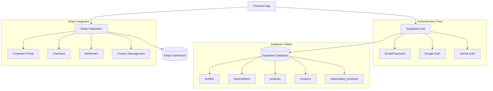
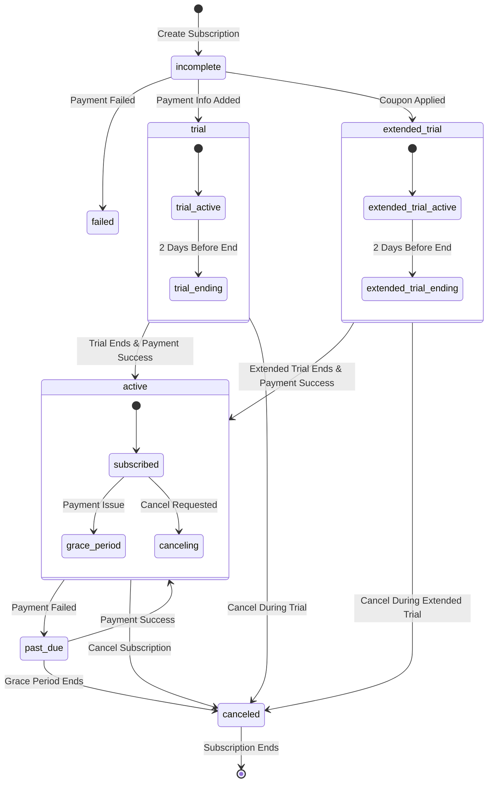

# Stripe and Supabase Integration Plan

## Architecture Overview



## Database Schema

### Supabase Tables

```sql
-- User profiles table
create table profiles (
    id uuid references auth.users primary key,
    email text,
    full_name text,
    stripe_customer_id text,
    created_at timestamp with time zone default timezone('utc'::text, now()) not null,
    updated_at timestamp with time zone default timezone('utc'::text, now()) not null
);

-- Products table (represents different subscription products like Keepa, Future Product A, etc.)
create table products (
    id uuid primary key default uuid_generate_v4(),
    stripe_product_id text unique,
    name text not null,
    description text,
    active boolean default true,
    created_at timestamp with time zone default timezone('utc'::text, now()) not null,
    updated_at timestamp with time zone default timezone('utc'::text, now()) not null
);

-- Product pricing tiers
create table product_prices (
    id uuid primary key default uuid_generate_v4(),
    product_id uuid references products(id),
    stripe_price_id text unique,
    price decimal not null,
    currency text default 'usd',
    interval text not null,
    trial_period_days integer default 7,
    active boolean default true,
    created_at timestamp with time zone default timezone('utc'::text, now()) not null,
    updated_at timestamp with time zone default timezone('utc'::text, now()) not null
);

-- Subscriptions table with detailed status tracking
create table subscriptions (
    id uuid primary key default uuid_generate_v4(),
    user_id uuid references auth.users not null,
    product_id uuid references products(id) not null,
    price_id uuid references product_prices(id) not null,
    stripe_subscription_id text unique,
    status text not null,
    trial_end timestamp with time zone,
    trial_start timestamp with time zone,
    current_period_start timestamp with time zone,
    current_period_end timestamp with time zone,
    cancel_at_period_end boolean default false,
    canceled_at timestamp with time zone,
    payment_status text,
    coupon_id uuid references coupons(id),
    created_at timestamp with time zone default timezone('utc'::text, now()) not null,
    updated_at timestamp with time zone default timezone('utc'::text, now()) not null
);

-- Coupons table
create table coupons (
    id uuid primary key default uuid_generate_v4(),
    stripe_coupon_id text unique,
    code text unique not null,
    description text,
    duration_in_days integer default 30,
    times_used integer default 0,
    max_redemptions integer,
    expires_at timestamp with time zone,
    active boolean default true,
    created_at timestamp with time zone default timezone('utc'::text, now()) not null,
    updated_at timestamp with time zone default timezone('utc'::text, now()) not null
);

-- Coupon usage tracking
create table coupon_redemptions (
    id uuid primary key default uuid_generate_v4(),
    coupon_id uuid references coupons(id),
    user_id uuid references auth.users,
    subscription_id uuid references subscriptions(id),
    redeemed_at timestamp with time zone default timezone('utc'::text, now()) not null
);
```

## Subscription Lifecycle States



## Implementation Steps

### 1. Initial Setup
- Install dependencies:
  ```bash
  npm install @supabase/supabase-js @stripe/stripe-js @stripe/stripe-react
  ```
- Configure environment variables:
  ```env
  VITE_SUPABASE_URL=your_supabase_url
  VITE_SUPABASE_ANON_KEY=your_supabase_anon_key
  VITE_STRIPE_PUBLISHABLE_KEY=your_stripe_publishable_key
  ```

### 2. Authentication Implementation
- Set up Supabase Auth context
- Implement social auth providers (Google, GitHub)
- Create protected routes
- Handle auth state changes

### 3. Product Management
```typescript
interface Product {
  id: string;
  name: string;
  description: string;
  prices: ProductPrice[];
  active: boolean;
}

interface ProductPrice {
  id: string;
  productId: string;
  stripePriceId: string;
  price: number;
  interval: 'month' | 'year';
  trialPeriodDays: number;
  active: boolean;
}
```

### 4. Coupon System
```typescript
interface Coupon {
  id: string;
  code: string;
  stripeCouponId: string;
  description: string;
  durationInDays: number;
  timesUsed: number;
  maxRedemptions: number | null;
  expiresAt: Date | null;
  active: boolean;
}

async function validateCoupon(code: string): Promise<Coupon | null> {
  // Check if coupon exists and is valid
  // Verify not expired
  // Check max redemptions not exceeded
  // Return coupon if valid
}
```

### 5. Stripe Integration
- Configure Stripe webhook endpoint
- Set up subscription checkout with trial/coupon support
- Implement customer portal
- Handle subscription lifecycle events

### 6. Subscription States Handler
```typescript
enum SubscriptionStatus {
  INCOMPLETE = 'incomplete',
  TRIALING = 'trialing',
  EXTENDED_TRIAL = 'extended_trial',
  ACTIVE = 'active',
  PAST_DUE = 'past_due',
  CANCELED = 'canceled',
  UNPAID = 'unpaid'
}

enum PaymentStatus {
  SUCCEEDED = 'succeeded',
  PENDING = 'pending',
  FAILED = 'failed'
}
```

### 7. Webhook Events to Handle
- `customer.subscription.created`
- `customer.subscription.updated`
- `customer.subscription.deleted`
- `invoice.payment_succeeded`
- `invoice.payment_failed`
- `invoice.upcoming`
- `coupon.created`
- `coupon.deleted`
- `coupon.updated`

### 8. Edge Functions
```typescript
// Create customer and initiate subscription
async function createSubscription(
  userId: string, 
  productId: string,
  priceId: string,
  couponCode?: string
) {
  // Create or retrieve Stripe customer
  // Validate coupon if provided
  // Create subscription with trial/coupon
  // Update database
}

// Handle subscription updates
async function handleSubscriptionUpdate(subscription: Stripe.Subscription) {
  // Update subscription status
  // Handle trial end
  // Handle cancellation
  // Update coupon usage if applicable
}

// Process webhook events
async function handleWebhookEvent(event: Stripe.Event) {
  // Verify webhook signature
  // Process different event types
  // Update database accordingly
}

// Coupon management
async function createCoupon(data: Partial<Coupon>) {
  // Create coupon in Stripe
  // Store in database
}

async function applyCoupon(
  subscriptionId: string,
  couponCode: string
) {
  // Validate coupon
  // Apply to subscription
  // Track redemption
}
```

### 9. Frontend Components
- Product selection interface
- Subscription status display
- Payment method management
- Trial period countdown
- Cancellation flow
- Reactivation flow
- Coupon code input and validation
- Multiple subscription management

### 10. Security Considerations
- Webhook signature verification
- Subscription status validation
- Payment intent confirmation
- User authorization checks
- Coupon code validation

### 11. Testing Scenarios
- New subscription with default trial
- New subscription with coupon code
- Trial conversion to paid
- Extended trial conversion to paid
- Failed payment handling
- Cancellation during trial/extended trial
- Cancellation of active subscription
- Reactivation of canceled subscription
- Payment method updates
- Multiple product subscriptions
- Coupon redemption limits
- Coupon expiration handling

## Implementation Timeline
1. Basic auth setup (2 days)
2. Database schema implementation (2 days)
3. Product management system (1 day)
4. Stripe integration (2 days)
5. Subscription management (3 days)
6. Coupon system implementation (2 days)
7. Webhook handling (2 days)
8. Frontend components (3 days)
9. Testing and refinement (2 days)

Total estimated time: 2.5 weeks